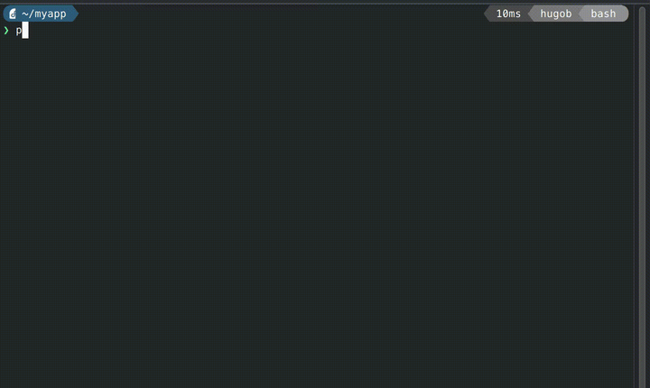

[](https://go.hugobatista.com/gh/secret-tool-run/releases)

# secret-tool-run 🔐

**Execute commands with secrets fetched encrypted from your keyring — never stored on disk.**

secret-tool-run is a CLI tool that stores secrets **encrypted** (AES-256-CBC, enabled by default) in your system's keyring, then loads them at runtime to run your commands — eliminating `.env` files from disk. Perfect for developers who want to keep credentials off the filesystem while maintaining a smooth development workflow.

## Quick Example



Instead of this (storing secrets on disk):
```bash
# ❌ Dangerous: secrets exposed on filesystem
cat .env  # DATABASE_PASSWORD=super_secret
python app.py
```

Do this (secrets from keyring):
```bash
# ✅ Secure: secrets loaded from keyring, never persisted to disk
secret-tool-run python app.py
```

**Under the hood:** secret-tool-run retrieves your secrets from the system keyring and passes them to your command — no permanent `.env` files on disk. It has three modes: **file mode** (default) writes a temp `.env` with secure permissions and deletes it after; **file descriptor mode** (`@SECRETS@`) passes secrets via an in-memory FD with zero disk writes; **source mode** (`--source`) exports secrets as real environment variables without writing any file.

> **🔒 Encryption by default:** All secrets are encrypted with AES-256-CBC before being stored in the keyring. An attacker who enumerates your keyring gets ciphertext, not plaintext. The decryption key is never stored in the keyring. Use `--plaintext` only when necessary.

## Why You Need This

**Three threats this eliminates at once. Security and usability — no trade-off.**

**1. File-harvesting malware.** Supply-chain attacks and post-exploitation tools scan disk for `.env` files and exfiltrate them. With `--source` or `@SECRETS@`, the file never exists on disk — nothing to steal.

**2. The `.env` in git accident.** One wrong `git add .` and credentials are in your repository history forever. No `.env` file on disk means nothing to stage, commit, or push.

**3. Process-table leaks.** The common pattern `export $(cat .env | xargs)` spawns `cat`, `xargs`, and `echo` subprocesses whose command-line arguments expose your secrets to any user running `ps aux`. `--source` passes secrets directly in the subprocess environment — no intermediate processes, no command-line arguments, no process-table leaks.

```bash
secret-tool-run --source ansible-playbook site.yml    # no file = no malware, no git risk
secret-tool-run --source ./deploy.sh                   # no subprocess = no ps leaks
secret-tool-run --source npm run dev                   # all three, every time
```

## Prerequisites

- **Python 3.11+**
- A keyring service: GNOME Keyring, KWallet, macOS Keychain, or Windows Credential Manager

## Installation

### From PyPI (Recommended)

```bash
pip install secret-tool-run
```

Or with uv:

```bash
uv tool install secret-tool-run
```

Or with pipx:

```bash
pipx install secret-tool-run
```

### From source

```bash
git clone https://go.hugobatista.com/gh/secret-tool-run.git
cd secret-tool-run
pip install .
```

## Usage

```bash
secret-tool-run [OPTIONS] COMMAND [ARGS...]
```

### Options

| Option | Description |
|--------|-------------|
| `--file FILE`, `-f FILE` | Secrets file path (default: `.env`) |
| `--app APP`, `-a APP` | Keyring app identifier (default: current folder name) |
| `--source`, `-s` | Source and export `.env` vars into the environment |
| `--password[=PASSWORD]` | Encrypt secrets with a password (AES-256-CBC). If omitted, resolves from `SECRET_TOOL_PASSWORD` env var or prompts. Stored under a separate keyring key (`app_name-encrypted`). |
| `--plaintext` | Disable encryption, store/retrieve secrets as plaintext (default: encryption enabled). |
| `--help`, `-h` | Show help message |

### Environment

| Variable | Description |
|----------|-------------|
| `SECRET_TOOL_PASSWORD` | Encryption password used automatically for encrypt/decrypt when set, unless overridden by `--password=PASSWORD`. |

> **Encrypted by default (AES-256-CBC).** Use `--plaintext` to opt out (not recommended).

## Modes of Operation

secret-tool-run has three modes for passing secrets to your command:

| Mode | How to enable | How secrets arrive | Writes to disk? |
|------|--------------|-------------------|-----------------|
| **File** (default) | No flag | Temp `.env` file, `SECRETS_FILE` points to it | Temp file, auto-deleted |
| **File Descriptor** | `@SECRETS@` token in args | In-memory FD as `/dev/fd/9`, `SECRETS_FILE=/dev/fd/9` | Never |
| **Source** | `--source` / `-s` flag | Exported as environment variables in the subprocess environment | Never |

Pick the mode that matches how your tool reads secrets. The examples below show each mode in action.

## Examples

### Example 1: Python development with uv

```bash
secret-tool-run uv run pywrangler dev
```

**What happens:**
1. Loads `.env` from keyring for current folder
2. Creates temporary `.env` file
3. Runs `uv run pywrangler dev` with secrets available
4. Deletes `.env` after command completes

### Example 2: Python project with hatch

```bash
secret-tool-run hatch run dev
```

Perfect for running development servers where you need environment variables but don't want them persisted on disk.

### Example 3: Ansible playbook with environment variables

```bash
secret-tool-run --source ansible-playbook site.yml
```

**Before secret-tool-run:**
```bash
source .env && ansible-playbook site.yml
```

**What happens with `--source`:**
1. Loads secrets from keyring (or uses local `.env` file if it exists)
2. Parses every `KEY=VALUE` pair and sets them in the subprocess environment
3. Runs `ansible-playbook site.yml` with all env vars available
4. No temp file is needed when loading from keyring — secrets stay in memory

Useful for any tool that expects secrets as environment variables — Ansible, Terraform, custom scripts, etc.

### Example 4: GitHub Actions local testing with act

```bash
secret-tool-run --file .secrets act --secret-file .secrets
```

**What happens:**
1. Uses custom file name `.secrets` instead of `.env`
2. Loads or prompts for secrets under that filename
3. Runs `act` with the secrets file
4. Cleans up `.secrets` after execution

This is especially useful for testing GitHub Actions workflows locally while keeping production secrets secure.

### Example 5: Multiple environments with custom app names

```bash
# Development environment
secret-tool-run --app myproject-dev npm start

# Production environment
secret-tool-run --app myproject-prod npm start
```

Each `--app` name is a separate keyring entry, allowing you to manage different secret sets (dev, staging, prod) for the same project.

### Example 6: Docker commands

```bash
secret-tool-run docker-compose up
```

Great for docker-compose files that source `.env` for configuration.

### Example 7: Just viewing the secrets file path

```bash
secret-tool-run env | grep SECRETS_FILE
```

The `SECRETS_FILE` environment variable contains the absolute path to the secrets file created by secret-tool-run.

### Example 8: File descriptor mode (no disk I/O)

```bash
secret-tool-run act --secret-file @SECRETS@
```

**What happens:**
1. Detects `@SECRETS@` token in arguments
2. Loads secrets from keyring into memory
3. Creates file descriptor at `/dev/fd/9` (no disk write)
4. Replaces `@SECRETS@` with `/dev/fd/9`
5. Runs `act` which reads secrets from the file descriptor
6. FD automatically closes — no cleanup needed

**Perfect for:**
- GitHub Actions local testing with `act`
- Docker with `--env-file`
- Any tool that can read from file descriptors

**Won't work for:**
- Shell sourcing (`source $SECRETS_FILE`)
- Tools that verify file exists with stat checks
- Tools that need to read the file multiple times

### Example 9: Docker with file descriptor mode

```bash
secret-tool-run docker run --env-file @SECRETS@ myimage
```

Secrets are loaded from keyring and passed to Docker without ever touching the disk. The `@SECRETS@` token automatically enables zero-disk-I/O mode.

## Advanced Features

### Custom Secrets File Locations

```bash
# Use a different file name
secret-tool-run --file .env.production npm run build

# Use a path in a different directory
secret-tool-run --file /tmp/my-secrets ./deploy.sh
```

### SECRETS_FILE Environment Variable

In **file mode** and **FD mode**, your command receives `SECRETS_FILE` pointing to the secrets source:

```bash
# File mode: points to temp .env
secret-tool-run bash -c 'echo "Secrets are at: $SECRETS_FILE"'
# FD mode: points to /dev/fd/9
secret-tool-run bash -c 'echo "Secrets are at: $SECRETS_FILE"' --secret-file @SECRETS@
```

In **source mode** (`--source`), `SECRETS_FILE` is not set — the secrets are already in the environment.

### File Descriptor Mode (No Disk I/O)

For maximum security, use the `@SECRETS@` token in your command to pass secrets via file descriptor without writing to disk:

```bash
secret-tool-run act --secret-file @SECRETS@
```

**How it works:**
- secret-tool-run detects the `@SECRETS@` token in your command arguments
- Loads secrets from keyring into memory only
- Creates file descriptor at `/dev/fd/9` (no disk write)
- Replaces `@SECRETS@` token with `/dev/fd/9` in all arguments
- Your command reads from the FD as if it were a file
- No temp file created, no cleanup needed
- FD automatically closes when command completes

**Security benefits:**
- Zero disk I/O — secrets never touch the filesystem
- No directory entry visible in `ls`
- Automatic cleanup (pipe closes on exit)
- No permission race conditions
- Simple, explicit syntax — just use `@SECRETS@` where you need it

**Compatibility:**

✅ **Works with these tools:**
```bash
secret-tool-run act --secret-file @SECRETS@
secret-tool-run docker run --env-file @SECRETS@ image
```

Replaced tokens work just like file paths:
```bash
secret-tool-run mycommand --config @SECRETS@ --output results.txt
# All @SECRETS@ tokens are replaced with /dev/fd/9
```

### Source Mode (Environment Variable Export)

For tools that expect secrets as actual environment variables (like Ansible, shell scripts, or tools that call `os.getenv`), use the `--source` flag:

```bash
secret-tool-run --source ansible-playbook site.yml
```

**How it works:**
- Before running your command, secret-tool-run parses the secrets into `KEY=VALUE` pairs
- These pairs are injected into the subprocess environment — your command sees them as real env vars
- **No temp file is written** — secrets are loaded directly from keyring into memory
- Works with `@SECRETS@` too — sources from keyring directly into env without touching disk
- When a local `.env` file already exists (not loaded from keyring), it is read directly from disk

**Which tools benefit from `--source`?**

| Tool | Without --source | With --source |
|------|-----------------|---------------|
| Ansible | `source .env && ansible-playbook ...` | `secret-tool-run --source ansible-playbook ...` |
| Terraform | `source .env && terraform plan` | `secret-tool-run --source terraform plan` |
| Shell scripts | `source .env && ./deploy.sh` | `secret-tool-run --source ./deploy.sh` |
| Any `os.getenv`/`$VAR` consumer | needs vars in environment | vars are exported automatically |

**Key difference:** without `--source`, secrets are written to a temp file and `SECRETS_FILE` env var is set.
With `--source`, secrets are loaded directly into memory — no temp file, no `SECRETS_FILE`, just real env vars.

**Combined with `@SECRETS@`:**
```bash
secret-tool-run --source ansible-playbook --vault-password-file @SECRETS@ site.yml
```
This both sources secrets into the environment AND passes one via file descriptor — maximum flexibility with zero disk writes.

### Encrypted Mode (Default, Password-Protected Secrets)

Encryption is **enabled by default**. All secrets are encrypted with AES-256-CBC before being stored in the keyring:

```bash
# Default: prompts for password (with confirmation) on first use
secret-tool-run npm start

# Password from environment variable
SECRET_TOOL_PASSWORD=hunter2 secret-tool-run npm start

# Explicit password (visible in ps — use with care)
secret-tool-run --password=hunter2 npm start

# Opt out of encryption
secret-tool-run --plaintext npm start
```

**How it works:**

1. Encrypted entries are stored under a separate keyring key: `app_name-encrypted` (distinct from the plaintext key `app_name`).
2. On lookup, the tool tries the encrypted key first. If found, it resolves the password and decrypts.
3. On first run (no existing entry), you'll be prompted for a password (with confirmation) unless `SECRET_TOOL_PASSWORD` or `--password=VALUE` is set.
4. Existing plaintext entries remain readable with a warning: `ℹ Found plaintext entry — not encrypted`. New entries will be encrypted.
5. Use `--plaintext` to disable encryption entirely (e.g., for CI/CD scripts that can't provide a password).

**Password resolution priority** (encrypt and decrypt):

| Priority | Source |
|----------|--------|
| 1 | `--password=VALUE` (explicit) |
| 2 | `SECRET_TOOL_PASSWORD` env var |
| 3 | Interactive prompt (with confirmation when storing) |

**Password confirmation:** When prompted interactively to create a new encrypted entry, the password is asked twice to prevent typos. The decrypt path (loading existing entries) prompts once without confirmation.

**Auto-detection:** If an encrypted entry exists and no password flags are passed, the tool resolves via env var or prompt automatically.

**Security:** Encrypted secrets resist D-Bus `GetSecret` attacks — an attacker who enumerates the keyring gets ciphertext, not plaintext. The decryption key is never stored in the keyring.

**Key derivation:** Uses PBKDF2-HMAC-SHA256 with 600,000 iterations and a random 16-byte salt for each encryption operation.

**CI/CD note:** If you run `secret-tool-run` in automation without a password, you must add `--plaintext` or set `SECRET_TOOL_PASSWORD`:
```bash
# After (encryption is default — choose one):
secret-tool-run --plaintext deploy.sh
# OR
SECRET_TOOL_PASSWORD=$(cat /etc/secret.txt) secret-tool-run deploy.sh
```

### First-Run Setup

On first use (when secrets aren't in keyring):

1. secret-tool-run prompts: "Paste your secrets content..."
2. Paste your `.env` content (KEY=VALUE format)
3. Press `Ctrl-D` to finish (or `Ctrl-C` to cancel)
4. Secrets are encrypted and stored in system keyring
5. Future runs load automatically

## Security Notes

- **Keyring encryption**: Secrets stored in your system's encrypted keyring service
- **File permissions** (file mode): Temporary files created with `600` permissions (owner read/write only)
- **Short-lived exposure** (file mode): Files on disk exist only during command execution
- **Zero disk I/O**: Use `@SECRETS@` (FD mode) or `--source` (source mode) — secrets never touch disk
- **No git commits**: No `.env` files left behind to commit accidentally
- **Session isolation**: Each terminal session can use different secrets with `--app` flag
- **Encrypted payloads** (AES-256-CBC): Secret content is encrypted with AES-256-CBC before keyring storage by default, protecting against D-Bus `GetSecret` enumeration attacks. See the section below for details. Use `--plaintext` to disable.

### Why Encrypted Mode Matters: The Keyring Enumeration Attack

The Linux Secret Service API (D-Bus) that powers GNOME Keyring, KWallet, and similar services is accessible to **any process running under your user account** — no authentication required. This means any code on your machine (malware, a compromised `pip install`, a malicious Node.js package, or even a curious colleague) can enumerate every item in your keyring:

```python
import secretstorage
bus = secretstorage.dbus_init()
col = secretstorage.get_default_collection(bus)
for item in col.get_all_items():
    print(f'  Label: {item.get_label()}')
    print(f'  Attributes: {item.get_attributes()}')
    print(f'  Secret: {item.get_secret().decode(errors="replace")}')
    print()
```

This is **not a vulnerability** in the keyring — it is by design. The keyring service provides session-level isolation (secrets are encrypted at rest when the session is locked), but once you unlock your keyring at login, any process sharing your D-Bus session can retrieve every secret in plaintext.

**This is why secret-tool-run encrypts by default.** When using encrypted mode (AES-256-CBC, enabled by default):

- An enumerating attacker sees only **ciphertext** — meaningless without the decryption password
- The decryption password is **never stored in the keyring** (resolved via interactive prompt, environment variable, or `--password` flag)
- Even if an attacker dumps every keyring entry, your secrets remain confidential

**When `--plaintext` is used**, secrets in the keyring are as exposed as `.env` files on disk — any process with D-Bus access can read them. Reserve `--plaintext` for ephemeral or isolated environments (e.g., CI containers where D-Bus access is restricted).

**⚠️ Important**: While secret-tool-run improves security, temporary files are still written to disk briefly in file mode. For maximum security:
- **Use `@SECRETS@`** for tools that accept a file path (FD mode — zero disk I/O)
- **Use `--source`** for tools that need env vars (source mode — zero disk I/O)
- Use encrypted home directories
- Ensure your keyring is properly locked when not in use
- Be cautious running secret-tool-run on shared systems

## Troubleshooting

### "Command fails with @SECRETS@"

The command may require a regular file instead of a file descriptor. Try without the `@SECRETS@` token:

```bash
# If this fails:
secret-tool-run mycommand --file @SECRETS@

# Try this instead:
secret-tool-run mycommand
```

### "No secrets found" on every run

The keyring store may have failed silently. Run with `--plaintext` and `--source` to trigger a fresh prompt:

```bash
secret-tool-run --plaintext --source your-command
```

### Command fails but secrets file remains

If your command crashes before cleanup runs, manually remove:

```bash
rm .env  # or your custom secrets file name
```

### Want to delete stored secrets

secret-tool-run does not include a delete command. Use your system's keyring tool to remove entries:

```bash
# On Linux (libsecret):
secret-tool clear app "your-app-name"

# Using the Python keyring library:
python -c "import keyring; keyring.delete_password('your-app-name', '__secrets__')"
```

## Uninstallation

```bash
pip uninstall secret-tool-run
```

Or with the tool installer you used:

```bash
uv tool uninstall secret-tool-run  # if installed with uv
pipx uninstall secret-tool-run     # if installed with pipx
```
