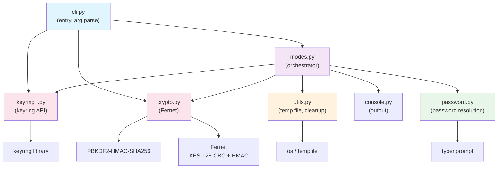
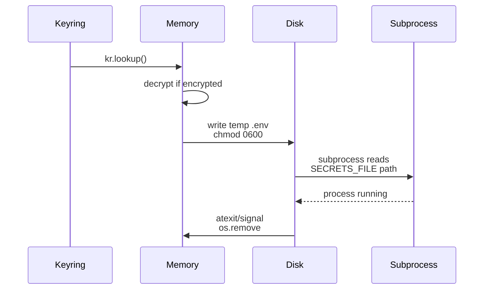
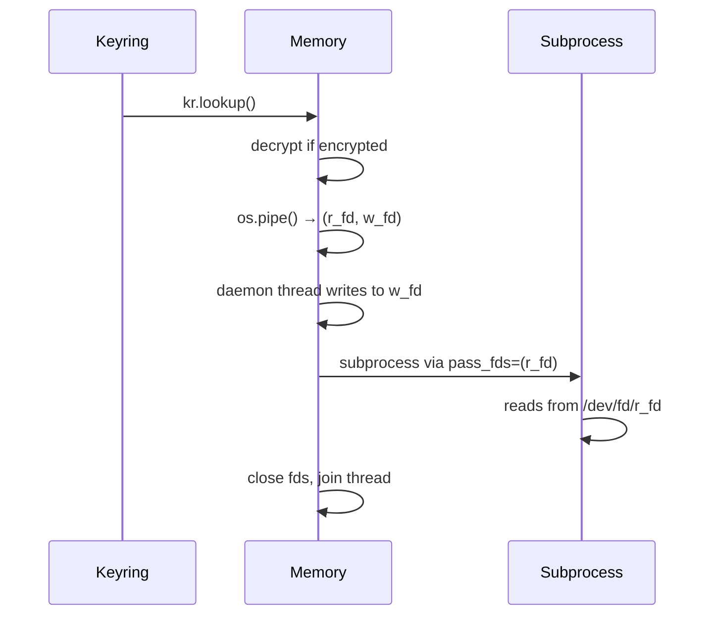
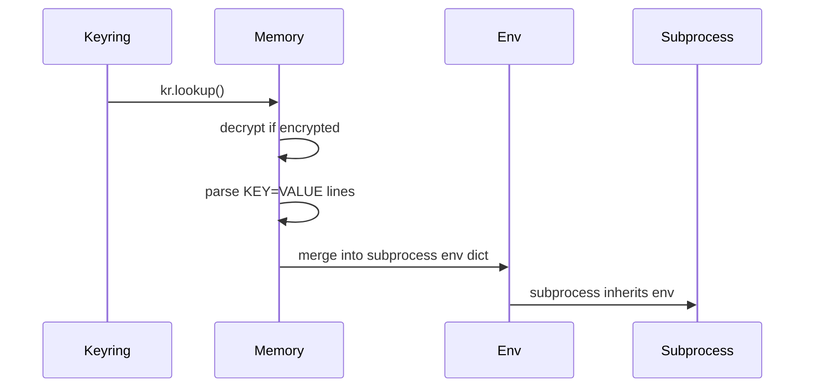
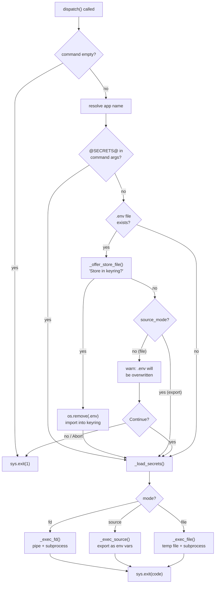
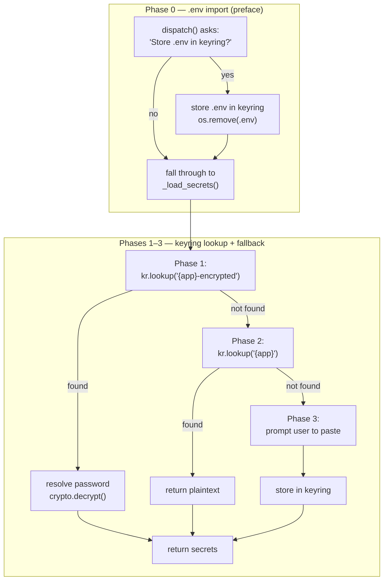

# Architecture

kleys is organized into focused modules that handle distinct concerns: CLI argument parsing, keyring interaction, encryption, and process execution.

## Module Structure



### Module responsibilities

| Module | Role |
|--------|------|
| **cli.py** | Entry point (`kleys.cli:main`). Manual arg parsing. Routes to `run`/`show`/`clear` handlers. |
| **modes.py** | **Orchestrator.** `dispatch()` handles: file import (Phase 0), keyring lookup (Phases 1–3), mode selection, subprocess execution. |
| **keyring_.py** | Thin wrapper over `keyring` library. Stores all entries under fixed username `"__secrets__"`. |
| **crypto.py** | Fernet encryption (AES-128-CBC + HMAC-SHA256). PBKDF2: SHA256, 600K iterations, random 16-byte salt. |
| **password.py** | Password resolution: `--password` > `KLEYS_PASSWORD` env > interactive prompt. Encrypt confirms twice; decrypt once. |
| **utils.py** | Temp file creation (`chmod 600`) and cleanup via `atexit` + signal handlers (`SIGINT`, `SIGTERM`). |
| **console.py** | Output styling: `info`, `success`, `warn`, `error`, `cmd` using `typer.secho`. |

## Secrets Routing: Per-Mode Data Flow

Each mode has a different path for secrets through the system.

### File Mode (default)



**Exposure:** Temp file on disk only while subprocess runs. Permissions `600` (owner-only).

### File Descriptor Mode (`@SECRETS@`)



**Exposure:** Zero disk I/O. In-memory pipe only. Unix only; Windows exits with error.

### Export Mode (`--export`)



**Exposure:** Zero disk I/O. Secrets in subprocess environment only. Works on all platforms.

## Dispatch Decision Flow

`dispatch()` in `modes.py` is the orchestrator. The flowchart below covers the full decision tree:



## Secrets Sourcing (4-phase)

Secrets are resolved in `_load_secrets()` after the `.env` import decision:



1. **Phase 0 — `.env` import (preface):** If a `.env` file exists and is not in FD mode, the user is asked whether to import it into the keyring. On "yes", the file is stored, removed, and execution falls through to normal keyring lookup. On "no", the `.env` file is ignored and execution also falls through to normal keyring lookup (in file mode, a warning is shown before overwriting the existing `.env`).

2. **Phase 1 — Encrypted lookup:** Look up `{app}-encrypted` in the keyring. If found, resolve the decryption password and decrypt.

3. **Phase 2 — Plaintext fallback:** Look up `{app}` (plaintext). If found, return it (with a warning if encryption is the default).

4. **Phase 3 — Interactive paste:** Neither found → prompt the user to paste secrets via stdin, store them in the keyring, and return.

Once stored, subsequent runs resolve from Phase 1 or 2 directly without prompting — unless a local `.env` file triggers Phase 0 again.

## Cleanup & Signal Handling

The `setup_cleanup()` function ensures temp files are deleted even if the subprocess crashes:

```python
atexit.register(cleanup)           # Normal exit
signal.signal(SIGINT, cleanup)     # Ctrl-C
signal.signal(SIGTERM, cleanup)    # Kill signal
```

---

For security details, threat model, and encryption protocol, see [SECURITY.md](SECURITY.md).
