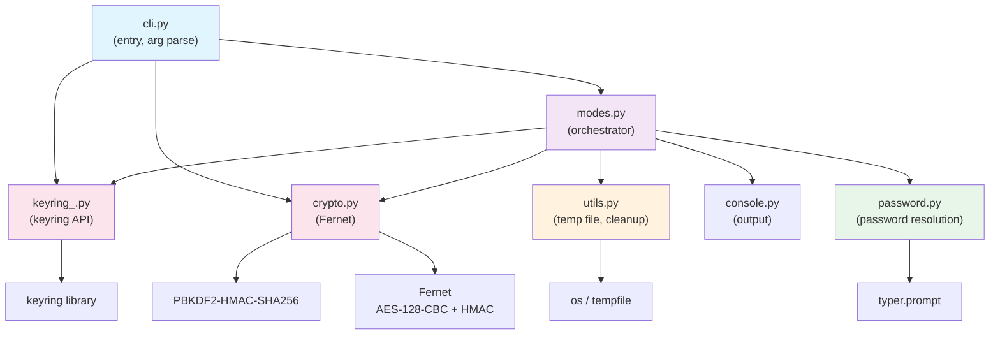
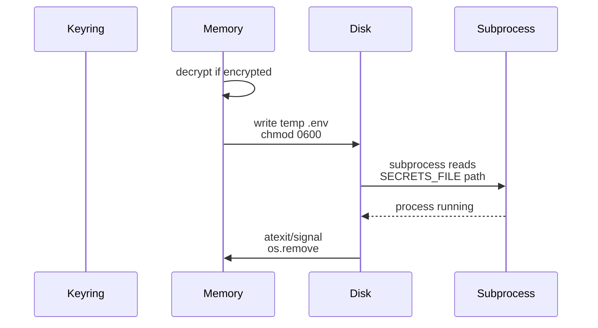
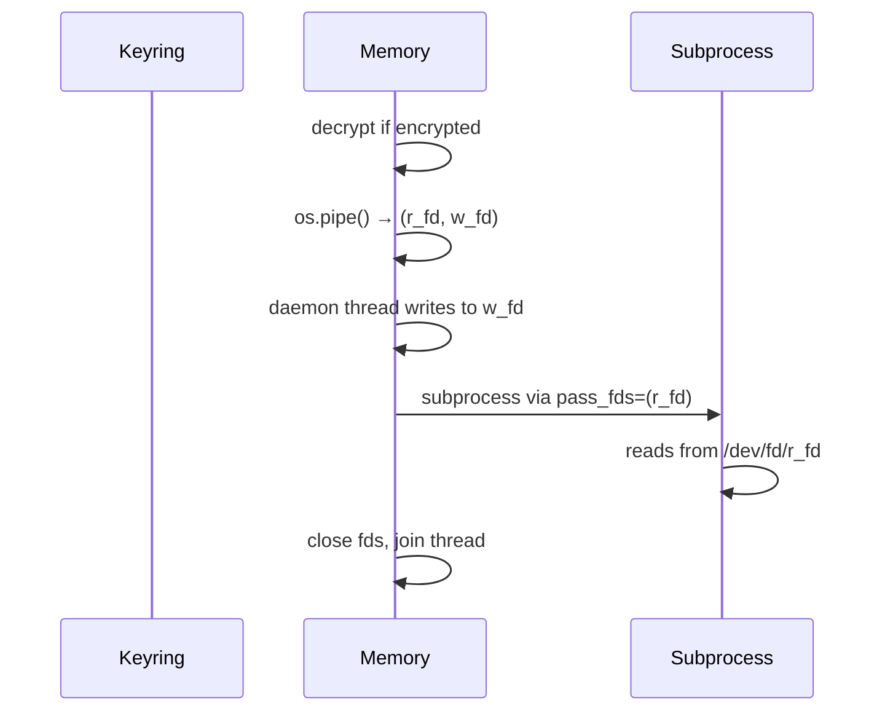
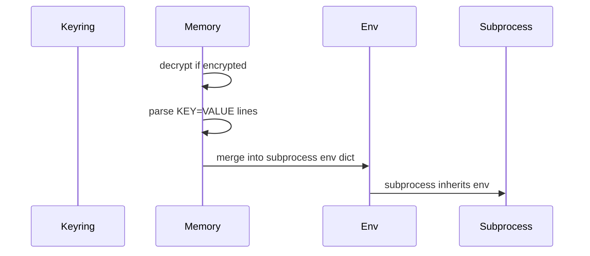

# Architecture

kleys is organized into focused modules that handle distinct concerns: CLI argument parsing, keyring interaction, encryption, and process execution.

## Module Structure



### Module responsibilities

| Module | Role |
|--------|------|
| **cli.py** | Entry point (`kleys.cli:main`). Manual arg parsing. Routes to `run`/`show`/`clear` handlers. |
| **modes.py** | **Orchestrator.** `dispatch()` handles: file import, keyring lookup (3-phase), mode selection, subprocess execution. |
| **keyring_.py** | Thin wrapper over `keyring` library. Stores all entries under fixed username `"__secrets__"`. |
| **crypto.py** | Fernet encryption (AES-128-CBC + HMAC-SHA256). PBKDF2: SHA256, 600K iterations, random 16-byte salt. |
| **password.py** | Password resolution: `--password` > `KLEYS_PASSWORD` env > interactive prompt. Encrypt confirms twice; decrypt once. |
| **utils.py** | Temp file creation (`chmod 600`) and cleanup via `atexit` + signal handlers (`SIGINT`, `SIGTERM`). |
| **console.py** | Output styling: `info`, `success`, `warn`, `error`, `cmd` using `typer.secho`. |

## Secrets Routing: Per-Mode Data Flow

Each mode has a different path for secrets through the system.

### File Mode (default)



**Exposure:** Temp file on disk only while subprocess runs. Permissions `600` (owner-only).

### File Descriptor Mode (`@SECRETS@`)



**Exposure:** Zero disk I/O. In-memory pipe only. Unix only; Windows exits with error.

### Export Mode (`--export`)



**Exposure:** Zero disk I/O. Secrets in subprocess environment only. Works on all platforms.

## Keyring Lookup (3-phase)

On `run` with no existing entry in keyring:

1. **Phase 1:** Look up `{app}-encrypted` entry
2. **Phase 2:** Look up `{app}` entry (plaintext fallback)
3. **Phase 3:** Neither found → interactive stdin prompt, store result

Once stored, subsequent runs load directly from keyring without prompting.

## Cleanup & Signal Handling

The `setup_cleanup()` function ensures temp files are deleted even if the subprocess crashes:

```python
atexit.register(cleanup)           # Normal exit
signal.signal(SIGINT, cleanup)     # Ctrl-C
signal.signal(SIGTERM, cleanup)    # Kill signal
```

---

For security details, threat model, and encryption protocol, see [SECURITY.md](SECURITY.md).
