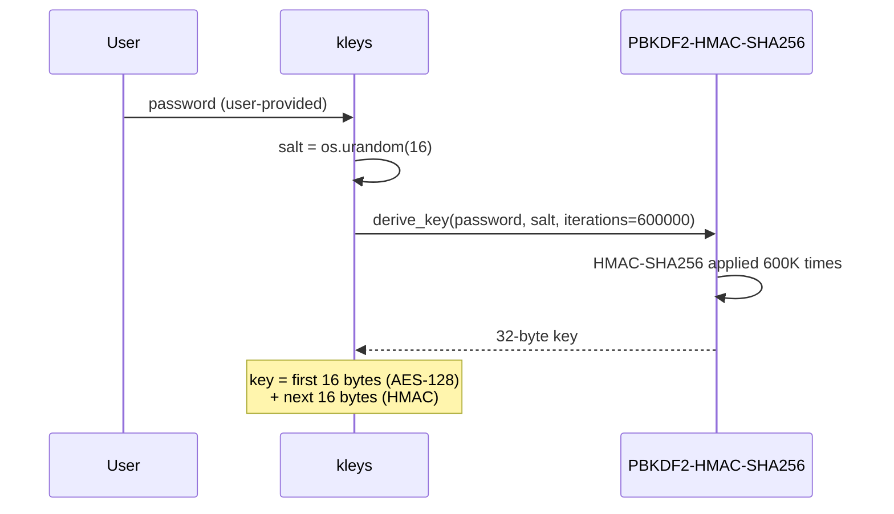

# Security Architecture

This document details the threat model, encryption design, and security trade-offs of kleys.

## Threat Model: Four Attacks Eliminated

### 1. File-Harvesting Malware

**Threat:** Supply-chain attacks, post-exploitation tools, and ransomware scan disk for `.env` files and exfiltrate them.

**kleys defense:**
- **File mode** writes secrets to a temp file only during command execution, then deletes it. File exists for minimal duration.
- **FD mode** (`@SECRETS@`) keeps secrets entirely in memory — no file written to disk. **Zero exposure.**
- **Export mode** (`--export`) loads secrets into memory and passes via environment — no file written to disk. **Zero exposure.**

**Recommendation:** Use `@SECRETS@` or `--export` on systems with active malware concerns.

### 2. The `.env` in git Accident

**Threat:** One `git add .` and credentials are in repository history forever, accessible to anyone with repo access or cloned copies.

**kleys defense:** Secrets never live in a `.env` file on disk. Nothing to accidentally stage, commit, or push. Requires explicit manual entry via stdin or keyring import.

**100% mitigation:** No file on disk means no git risk, period.

### 3. Process-Table Leaks

**Threat:** The pattern `export $(cat .env | xargs)` spawns intermediate processes (`cat`, `xargs`, `echo`) whose command-line arguments expose secrets to any user running `ps aux`.

**kleys defense:**
- **Export mode** (`--export`) passes secrets directly in the subprocess environment without intermediate processes.
- The decryption and parsing happen inside kleys, not in shell subprocesses.
- Your command sees secrets as inherited env vars, not as command-line arguments.

**Attack pattern prevented:**
```bash
# ❌ Dangerous: creates ps-visible processes
export $(cat .env | xargs)  # → "cat", "xargs", "echo" see secrets

# ✅ Secure: no intermediate processes
kleys --export mycommand    # → secrets go directly to subprocess env
```

### 4. LLM Data Exposure

**Threat:** Secrets in `.env` files on disk can be read by AI coding agents with filesystem access, even with safety instructions. Additionally, secrets pasted into LLM prompts for debugging may be retained in training data or exposed through breaches.

**kleys defense:**
- **File mode** — Temp file exists only during execution, minimal window for agent access.
- **FD mode** — Secrets never written to disk; agent cannot find file to read.
- **Export mode** — Secrets never written to disk; agent cannot find file to read.
- **Zero file source** — Nothing to accidentally paste into an LLM prompt.

**Recommendation:** Use `@SECRETS@` or `--export` to eliminate the file entirely.

---

## Keyring Attack Surface: D-Bus Enumeration

### Architecture

The Linux Secret Service API (D-Bus) is the underlying transport for GNOME Keyring, KWallet, and similar services. **Any process running under your user account can enumerate D-Bus to discover and retrieve keyring secrets — no authentication required.**

```
Your User Session
├── kleys process
│   └── keyring library
│       └── D-Bus session bus (accessible to all user processes)
├── Attacker process (malware, compromised pip package, etc.)
│   └── secretstorage library
│       └── D-Bus GetSecret() calls → D-Bus daemon responses
└── Keyring daemon (gnome-keyring, kwallet, etc.)
    ├── {app-name} entry
    │   └── plaintext (if --unencrypted used)
    └── {app-name}-encrypted entry
        └── Fernet ciphertext + salt
```

### Without Encryption (`--unencrypted`)

An attacker's process can enumerate the keyring:

```python
import secretstorage
bus = secretstorage.dbus_init()
col = secretstorage.get_default_collection(bus)
for item in col.get_all_items():
    secret = item.get_secret().decode()  # Plaintext
    print(f"Found secret: {secret}")
```

**Result:** Attacker reads plaintext secrets.

### With Encryption (default)

```python
import secretstorage
bus = secretstorage.dbus_init()
col = secretstorage.get_default_collection(bus)
for item in col.get_all_items():
    secret = item.get_secret().decode()
    # secret = "base64_salt:base64_encrypted_token"
    # Useless without the decryption password
    print(f"Found ciphertext: {secret}")
```

**Result:** Attacker reads ciphertext only. Decryption password is **never stored in the keyring** — it's resolved from:
1. `--password` CLI flag
2. `KLEYS_PASSWORD` env var
3. Interactive prompt (TTY only)

Without the password, the ciphertext is cryptographically secure against brute-force (600K PBKDF2 iterations).

---

## Encryption Protocol

### Key Derivation (PBKDF2)



**Parameters:**
- **Algorithm:** PBKDF2-HMAC-SHA256
- **Iterations:** 600,000 (OWASP 2023 recommendation for SHA256)
- **Salt:** 16 random bytes per encryption operation (prevents rainbow tables)
- **Output:** 32 bytes (256 bits)

**Why random salt per operation:** Encrypting the same plaintext with the same password twice produces different ciphertexts. Prevents keyring entries from being compared or pattern-matched.

### Encryption (Fernet)

```
plaintext + password
  │
  ├─ PBKDF2(password, salt, 600K iterations) → 32-byte key
  ├─ Fernet(key).encrypt(plaintext) → token
  │   └─ AES-128-CBC (first 16 bytes of key)
  │   └─ HMAC-SHA256 (next 16 bytes of key) for authentication
  │
  └─ return: base64(salt) + ":" + base64_urlsafe(token)
```

**Stored in keyring:** `salt:encrypted_token`

**Example:**
```
WEk7r2pV+Z4=:gAAAAABlmfvV8X...  (URL-safe base64)
```

### Decryption

```
ciphertext + password
  │
  ├─ split on ":" → salt_b64, token_b64
  ├─ PBKDF2(password, base64_decode(salt), 600K iterations) → 32-byte key
  ├─ Fernet(key).decrypt(token) → plaintext
  │
  └─ return plaintext (or None on any error)
```

**Error handling:** If password is wrong, salt is corrupted, or token is tampered, `decrypt()` returns `None` and kleys exits with an error.

---

## Threat Coverage Matrix

Which kleys feature protects against which threat:

| Threat | File mode | FD mode | Export mode | Encryption |
|--------|-----------|---------|-------------|-----------|
| **File-harvesting malware** | Partial (brief window) | ✅ Full | ✅ Full | — |
| **Git accidents** | ✅ Full | ✅ Full | ✅ Full | — |
| **Process-table leaks** | ✅ Full | ✅ Full | ✅ Full | — |
| **LLM data exposure** | Partial (brief window) | ✅ Full | ✅ Full | — |
| **D-Bus enumeration** | — | — | — | ✅ Full |

**Key insight:** 
- **Execution modes** (File, FD, Export) address the *external threat* of malware reading files or git accidents by eliminating disk I/O and intermediate processes.
- **Encryption** addresses the *internal threat* of D-Bus enumeration by any process with local access.
- **Use both:** `kleys --export` (zero disk, no intermediate processes) + encryption (default) = maximum protection.

---

## Mode Security Trade-offs

### File Mode (default)

**Trade-off:** Convenience vs. brief disk exposure.

- **Pros:** Works everywhere, compatible with all tools, SECRETS_FILE env var available
- **Cons:** Temp file on disk (though auto-deleted), permission race conditions possible
- **Risk window:** Only while subprocess runs, but detectable in `/tmp`

**Best for:** Local development, tools that must read from a file path.

**Avoid when:** Running on shared systems or when malware is a concern.

### FD Mode (`@SECRETS@`)

**Trade-off:** Security vs. Unix-only limitation.

- **Pros:** Zero disk I/O, automatic cleanup, undetectable (no directory entry)
- **Cons:** Unix/macOS only (Windows exits with error), requires tool support for `/dev/fd/N`
- **Risk window:** Secrets in subprocess memory while reading FD

**Best for:** CI/CD, Docker, any Unix tool that accepts a file descriptor path.

**Note:** Not all tools support FD mode — some verify file existence with `stat()` or require a regular file.

### Export Mode (`--export`)

**Trade-off:** Maximum compatibility vs. environment variable visibility.

- **Pros:** Works on all platforms, transparent to tools, zero disk I/O
- **Cons:** Secrets visible via `ps e` if process is still running, tools must use env vars
- **Risk window:** Secrets in subprocess environment while process runs

**Best for:** Tools that consume env vars (Terraform, Ansible, shell scripts).

**Note:** `ps e` shows environment only for running processes. Once subprocess exits, env vars disappear.

---

## Encryption Configuration

### Default Behavior (Encrypted)

```bash
# First run: prompts for password, stores encrypted
kleys npm start

# Password saved implicitly in memory during session
# Subsequent runs: prompts again (or reads KLEYS_PASSWORD)
kleys npm start  # → asks for password
```

Entries stored as `{app}-encrypted` in keyring.

### CI/CD Configuration

In automation, provide password via environment or use `--unencrypted`:

```bash
# Via environment variable
KLEYS_PASSWORD=$(cat /etc/secrets/kleys-pw) kleys deploy.sh

# Or disable encryption (if in isolated CI container)
kleys --unencrypted deploy.sh
```

**Recommendation:** Always use `KLEYS_PASSWORD` in CI/CD to maintain encryption end-to-end.

### Opting Out

```bash
# Disable encryption (plaintext in keyring)
kleys --unencrypted npm start

# Entry stored as `{app}` (not `{app}-encrypted`)
# Readable by any D-Bus client
```

**When to use:** 
- Isolated CI environments where D-Bus access is restricted
- Development machines in fully controlled networks
- **Not recommended** for personal workstations

---

## Best Practices

1. **Always use encryption** (default) on personal machines and development workstations.
2. **Use `--export` or `@SECRETS@`** to eliminate disk I/O when possible.
3. **Use `KLEYS_PASSWORD` in CI/CD** to maintain encrypted secrets end-to-end.
4. **Lock your keyring** when away from your machine (`gnome-control-center`, KWallet settings).
5. **Rotate secrets regularly** using `kleys clear` and re-entering them.
6. **Use different `--key` names** for different environments (dev, staging, prod) to avoid confusion.
7. **Never put secrets in version control** — not even encrypted `.env` files. Use kleys instead.

---

For architecture and data flow details, see [ARCHITECT.md](ARCHITECT.md).
